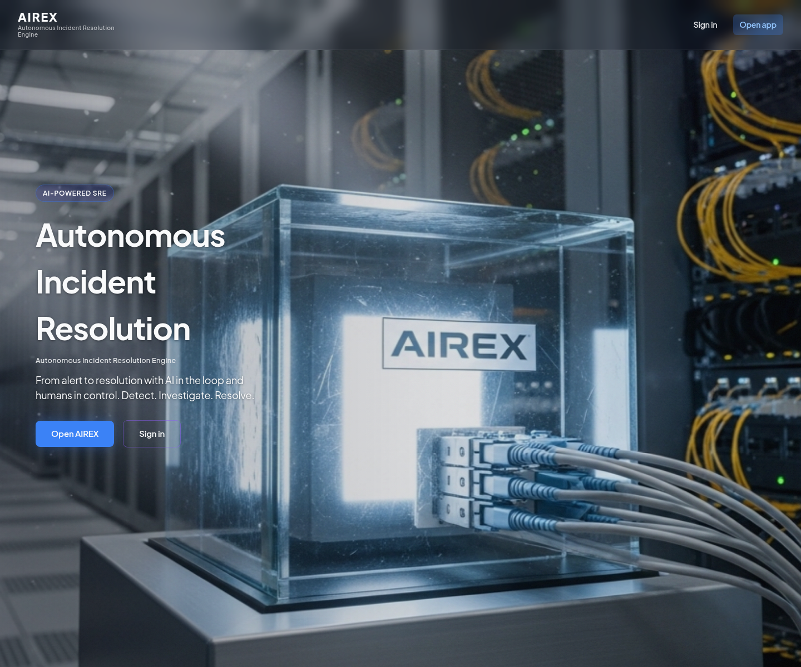

# AIREX


AIREX stands for **Autonomous Incident Resolution Engine Xecution**. It is a safety-conscious incident automation platform that ingests alerts, investigates affected systems, generates AI-assisted recommendations, applies policy and approval rules, executes deterministic remediation actions, and verifies the outcome.



## Why It Exists

AIREX is designed to reduce mean time to resolution for operational incidents without sacrificing control. It combines deterministic backend rules, auditable state transitions, cloud investigation workflows, and approval-gated AI assistance so operators can move faster without giving up safety.

## What AIREX Does

1. Ingests alerts from sources like Site24x7 and generic webhook senders.
2. Creates and tracks incidents through a strict backend state machine.
3. Runs investigation probes across cloud and system surfaces.
4. Generates structured AI recommendations through LiteLLM.
5. Requires approval when policy demands it and blocks unsafe execution paths.
6. Executes whitelisted remediation actions through controlled worker flows.
7. Verifies post-action health and keeps an auditable incident timeline.

## Current Monorepo Layout

```text
services/
  airex-core/            Shared Python package (models, services, core, schemas, actions, cloud, investigations, llm, rag, monitoring)
  airex-api/             FastAPI service package + Dockerfile (23 API routers)
  airex-worker/          ARQ worker service package + Dockerfile (6 background tasks)
  litellm/               LiteLLM container config
  langfuse/              Langfuse deployment notes
apps/web/                React 19 + Vite 7 frontend + Dockerfile (19 pages, 165 tests)
database/                Alembic migrations (21 applied) and standalone migration image
tests/                   Backend pytest suite (525 tests passing)
e2e/                     Playwright end-to-end tests
scripts/                 Utility scripts (admin user creation, etc.)
config/                  Legacy/static configuration and credential file layout (tenant registry lives in PostgreSQL)
deployment/              ECS Terraform + CodePipeline + CodeBuild assets
docs/                    Project architecture, skills, and runbooks
infra/                   Prometheus, Grafana, and AI platform config
```

## Architecture Overview

### Core Services
- `services/airex-core`: shared Python package used by API and worker runtimes.
- `services/airex-api`: FastAPI runtime package and container entrypoint.
- `services/airex-worker`: ARQ runtime package and worker entrypoint.
- `apps/web`: operational UI for incident review, approvals, evidence, runbooks, and health dashboards (includes Dockerfile).
- `database`: isolated migration pipeline with Alembic under `database/alembic/`.

### Runtime Dependencies
- PostgreSQL with pgvector for application data and retrieval features.
- Redis for ARQ queues, pub/sub, and runtime coordination.
- LiteLLM for model routing and external AI provider access.
- Prometheus, Grafana, and Alertmanager for observability.

### Incident Lifecycle (11 States)
`RECEIVED -> INVESTIGATING -> RECOMMENDATION_READY -> AWAITING_APPROVAL -> EXECUTING -> VERIFYING -> RESOLVED`

Failure states remain explicit: `FAILED_ANALYSIS` (retryable), `FAILED_EXECUTION`, `FAILED_VERIFICATION` (retryable), and `REJECTED` (human-driven rejection).

Terminal states: `RESOLVED`, `REJECTED`  
Retryable states: `FAILED_ANALYSIS`, `FAILED_VERIFICATION`

## Safety Principles

- **Deterministic actions only** — 12 whitelisted actions in ACTION_REGISTRY, no arbitrary shell from LLM output
- **State machine is law** — All incident state changes must go through `transition_state(...)` helpers with immutable audit trail
- **Zero-trust cloud** — No stored credentials, IAM roles/Workload Identity only
- **Structured logging** — JSON logs with correlation IDs across all backend flows
- **Policy-first execution** — Confidence-based auto-approval with senior approval gates
- **Tenant-safe patterns** — Every RLS-backed row is scoped by **`tenant_id`**; organizations are a separate hierarchy for billing and access. UI and API resolve the active tenant from auth plus optional tenant headers.

## Local Development

### Backend

```bash
cd services/airex-api
python3 -m venv .venv
source .venv/bin/activate
pip install -r requirements.txt
uvicorn app.main:app --reload
```

### Worker

```bash
cd services/airex-worker
python3 -m venv .venv
source .venv/bin/activate
pip install -r requirements.txt
arq app.core.worker.WorkerSettings
```

### Frontend

```bash
cd apps/web
npm install
npm run dev
```

### Database Migrations

```bash
cd database
alembic history
alembic upgrade head
```

### Local Stack

```bash
docker-compose up -d db redis ai-platform
docker-compose up -d
docker-compose run migrate
```

`docker-compose up -d` brings up the full local stack, including `frontend` on `http://localhost:5173`, backend on `http://localhost:8000`, Redis, PostgreSQL, LiteLLM, and observability services. The frontend now waits for a healthy backend before it starts.

## MCP Server Configuration

The repository includes an `mcp.json` configuration file to easily bootstrap context and capabilities for AI development assistants supporting the Model Context Protocol (MCP). The configuration includes access to:
- **Local environment:** Filesystem and Shell execution
- **Automation:** Playwright and Puppeteer for headless browser tasks
- **Infrastructure:** Docker and Terraform
- **External tools:** Exa Websearch, grep.app search, and Google Drive integrations
- **Context:** Persistent memory and advanced code navigation (using jcodemunch)

You can load or merge this file into your AI assistant's MCP settings to drastically enhance its ability to operate, test, and manage the AIREX project.

## Verification Commands

### Backend

```bash
# Lint + type check
cd services/airex-core
ruff check airex_core/
mypy airex_core/ --ignore-missing-imports

# Tests (525 passing)
cd tests
pytest
python -m pytest tests/test_state_machine.py
```

### Frontend

```bash
cd apps/web
npm run lint
npm run test -- --run  # 165 tests
npm run build
```

### E2E

```bash
cd e2e
npm install
npm run test
```

## Deployment Notes

### Live Environments
- **Frontend / API:** [https://airex.ankercloud.com/](https://airex.ankercloud.com/)
- **Langfuse:** [https://airex-langfuse.ankercloud.com/](https://airex-langfuse.ankercloud.com/)
- **LiteLLM:** [https://airex-litellm.ankercloud.com/](https://airex-litellm.ankercloud.com/)

### Project Infrastructure
- `services/airex-api/Dockerfile` builds the API runtime image.
- `services/airex-worker/Dockerfile` builds the worker runtime image.
- `services/airex-frontend/Dockerfile` builds the frontend image from `apps/web/`.
- `database/Dockerfile` builds a standalone migration image.
- `deployment/ecs/codebuild/buildspec.frontend.yml` publishes the frontend from `apps/web/dist` to S3 + CloudFront.

## Documentation Map

- [AGENTS.md](AGENTS.md) - repo workflow rules and validation commands
- [docs/backend_skill.md](docs/backend_skill.md) - backend implementation rules
- [docs/frontend_skill.md](docs/frontend_skill.md) - frontend implementation rules
- [docs/database_skill.md](docs/database_skill.md) - database and migration rules
- [docs/architecture.md](docs/architecture.md) - broader architecture notes
- [TECH_STACK.md](TECH_STACK.md) - expanded technology reference

## Ownership

AIREX is maintained as a proprietary project. See [LICENSE](LICENSE) for usage restrictions and ownership attribution.
