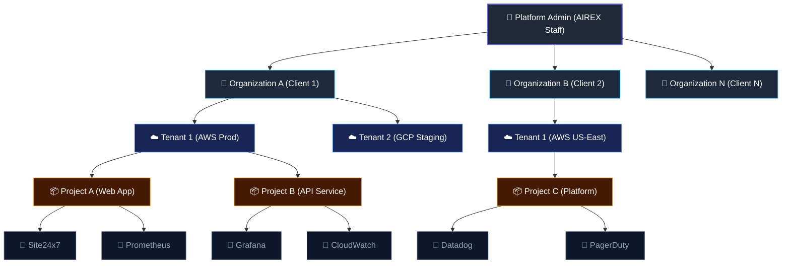

# 🚀 AIREX Combined Architecture & Management Plan

> Scope: Complete isolation of Platform Administration (Global) from Organization/Tenant Management (Scoped), along with the target architectural structure.

---

## PART 1: Proposed Architecture (Target State)

The following diagram illustrates the structural hierarchy of the AIREX platform, detailing how permissions and ownership cascade from global platform administration down to individual integration plugins.

---

## PART 2: Platform Administration (Global Scope)
The Platform Admin is the highest-level user (AIREX internal staff) responsible for managing the SaaS infrastructure and clients (Organizations). They do not deal with individual alerts or low-level project data unless troubleshooting.

### 2.1 Core Responsibilities
- **Organization Provisioning:** Create, suspend, and delete Organizations.
- **Global Settings:** Configure AI/LLM providers, pipeline limits, and circuit breakers.
- **Integration Catalog:** Manage the global definitions of available integration types.
- **System Health:** Monitor ARQ queues (DLQ), backend status, database health.
- **Platform Analytics:** Track total users, active organizations, and platform-wide error rates.

### 2.2 Platform Architecture Changes
- **RBAC Updates:** Introduce the `PLATFORM_ADMIN` role in `rbac.py` to bypass standard tenant checks.
- **Global Integration Catalog:** Seed `integration_types` table (e.g., Site24x7, Prometheus, Grafana, Datadog) with their required `config_schema_json`.

### 2.3 Frontend UI Isolation
- **Isolated Login:** `AdminLoginPage.jsx` specifically for platform administrators, redirecting to `/admin` with no tenant context.
- **No Shared Context:** Removed active tenant headers, tenant ID displays, and dashboard links from the platform admin view to enforce isolation.

---

## PART 3: Organization & Tenant Management (Scoped)
Organizations (Clients) contain multiple Tenants (Cloud Environments). Users belong to the Organization but are assigned specific roles for specific Tenants. 

### 3.1 Core Principles
- **Total Isolation:** Tenants cannot see each other's data, alerts, or plugins.
- **Granular Access:** A user can be an Admin in Tenant A, an Operator in Tenant B, and have zero access to Tenant C.
- **Organization Admin:** Can see all tenants within their Organization and assign users to those tenants.

### 3.2 Role Hierarchy & Visibility

| Role | Scope | Can See | Can Do |
|------|-------|---------|--------|
| **Org Admin** | Organization | All tenants within their org, all alerts/incidents | Manage tenants, assign tenant members, create projects, configure plugins |
| **Tenant Admin** | Specific Tenant | Only alerts/incidents/projects/plugins for assigned tenant | Manage projects & plugins within their tenant, invite operators |
| **Operator** | Specific Tenant | Only alerts/incidents for assigned tenant | Acknowledge, approve/reject actions, resolve incidents |
| **Viewer** | Specific Tenant | Only alerts/incidents for assigned tenant | View-only — dashboards, analytics, incident history |

### 3.3 Data Isolation Enforcement
- **Incident Queries:** Automatically scoped by `TenantSession` via the `X-Active-Tenant-Id` header.
- **`GET /organizations/{id}/analytics`:** Must aggregate only across the user's accessible tenants.
- **Sidebar Tenant List:** Must query `GET /users/{user_id}/accessible-tenants` and hide tenants the user isn't assigned to.

---

## PART 4: Alert Source Mapping
- **Site24x7:** Webhook (push). Webhook payload maps to a Project, which securely maps to the Tenant id.
- **GCP / AWS:** API (pull). Triggered during investigation context based on the affected Tenant's config.
- **Custom Webhooks:** Webhook (push). Generic receiver validates HMAC and maps to the Tenant id.
- **AI Recommendations:** Instead of general recommendations, the AI pipeline relies strictly on the `IntegrationType` context passed by the active tenant.

---

## PART 5: Implementation Roadmap

**Phase 1: Member Management & RBAC**
- `require_platform_admin()` dependency for global routes.
- `GET/POST /tenants/{id}/members` for Org Admins to grant granular tenant access.
- Org Admins UI panel to view the user × tenant access matrix.

**Phase 2: UI Isolation & Dashboards**
- Analytics metrics and Sidebar tenant lists filtered by accessible tenants.
- Finalize the `OrganizationsAdminPage.jsx` for Platform Admins.

**Phase 3: Plugin Management UI**
- Global integrations catalog (`GET /integration-types`).
- UI to configure API keys (Datadog, AWS, GCP) per tenant.
- "Test Connection" functionality scoped strictly to the tenant's workspace.
